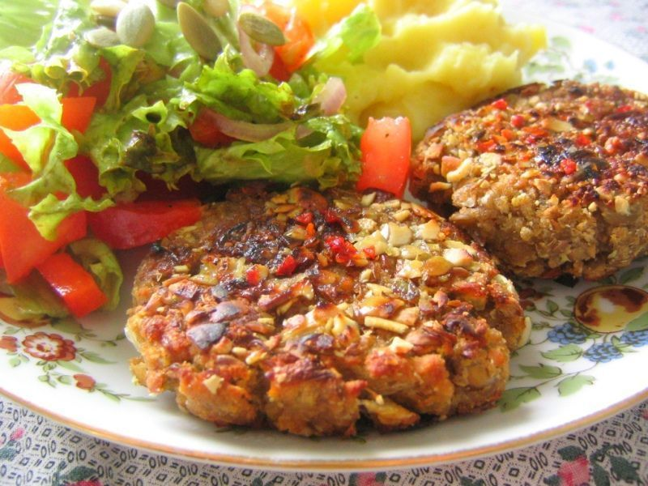

# My Page
ESte proyecto tiene como reto hacer que la página se adapte al tamaño del dispositivo que el usuario utilice. Para ellos debemos utilizar los @media queris y las grid sistem. Además la pagina cumple con ciertas características que se debe tener en cuenta.

## Objetivo
+ Que podamos utilizar los `@medias queries` en este reto.
+ El poder definir como logar el efecto solicitado.
+ Trabajar con `CSS`.

## Encontrarás 
+ Una carpeta `assets` en donde encontrarás las imagenes utilizadas o la imagen puede ser elegida por uno mismo.
+ Una carpeta `CSS`
+ Un archivo `index.html`.

 
